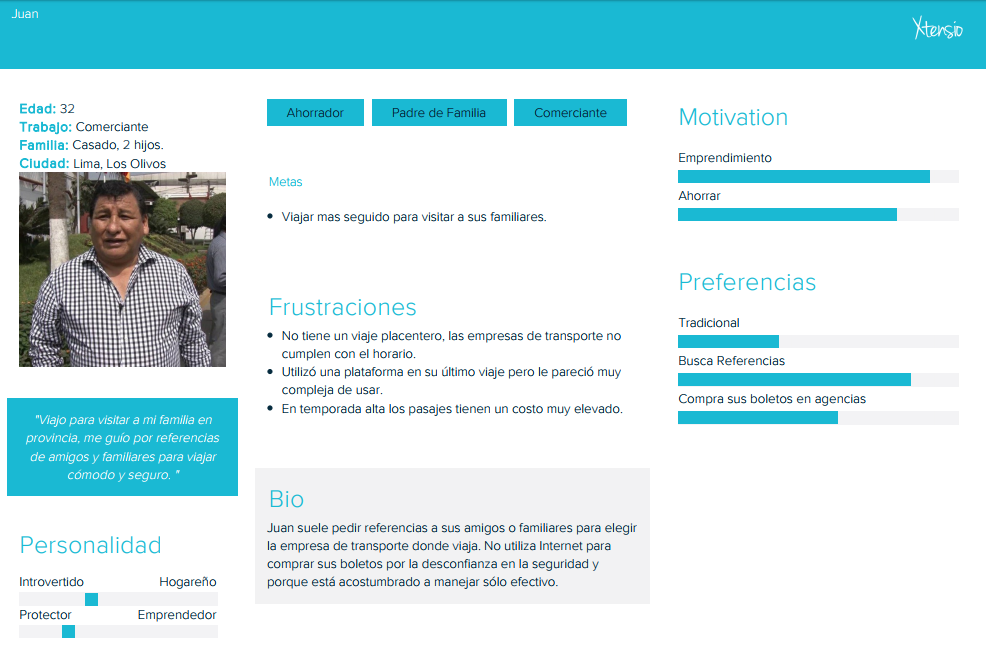
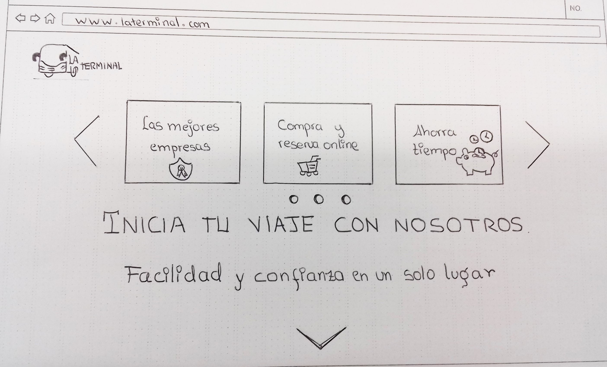
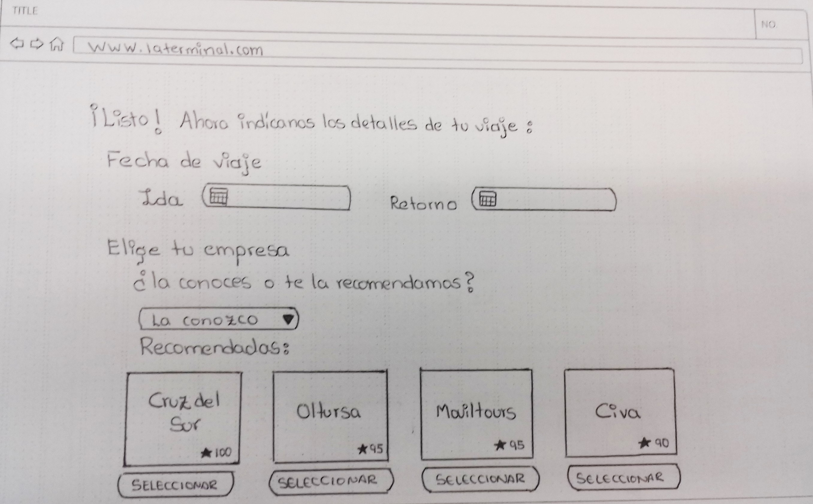
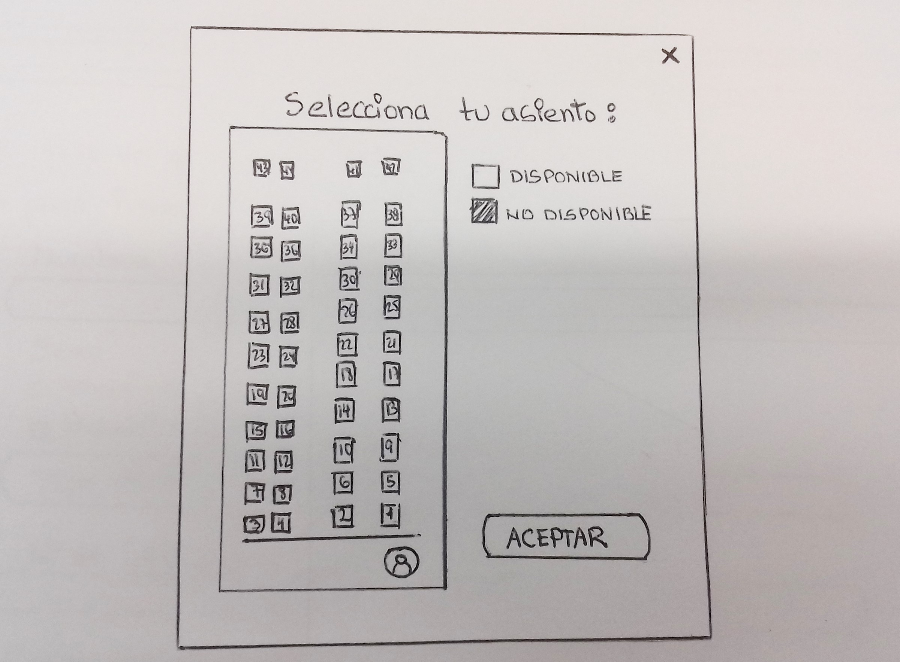
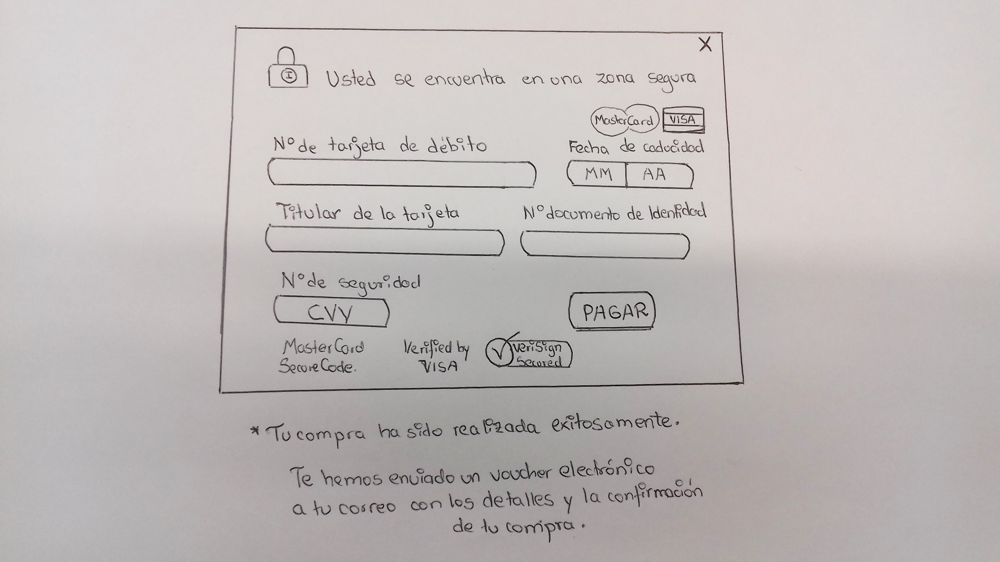

# **UX - Reto**

## **Objetivo:**

Diseñar la plataforma de venta de boletos de buses más intuitiva y amigable para el usuario.

## **Fases del Proceso:**

Para llevar a cabo el reto se sseguirá el proceso de UXD:
    

## **1. Descubrimiento e investigación**

### **User Research**:

Metodologías utilizadas:

* _Research Cuantitativo:_ Encuestas por internet.

* _Research Cualitativo:_ Entrevistas a usuarios en campo.

Las encuestas se realizaron el martes 30 del presente mes en dos puntos estratégicos: Terminales de buses ubicadas en 28 de Julio y Plaza Lima Norte.

_Fotos de la investigación:_  [Click](https://photos.google.com/share/AF1QipNhjbtJdhZl_5NInrbAaW0SVUJ8yRCoweozimCIk9GZrEK-VH0fg5nIPoU-KuciCA?key=UEtzQ2tfcVFSWG9UVmkwYlIxOGVEQmxGb2liMC13)

## **2. Síntesis y Definición**

Recabados y procesados los insights, se procedió a lo siguiente:

- ###  **Mapas de Afinidad (Affinity maps):**

    Mediante este, se agruparon los comentarios de los usuarios en siete aspectos claves: 
    Uso del internet, compra en agencias, servicios, temores de los usuarios, experiencia de viaje, costo de servicios y recomendaciones.

    

- ### **Selección del problema:** 

    Debido a que se notó un gran contraste entre los usuarios que compran sus pasajes vía internet vs. los que compran directamente en las agencias, se optó por elegir dicha problemática (¿por qué los peruanos no compran sus pasajes por internet?).

- ### **Definición del problema:**
    Las respuestas que más usuarios nos dieron fue la siguiente: "No compro por internet porque me da miedo ser estafado". Y es precisamente ésta una de las razones por las que el peruano promedio no compra por internet. El usuario peruano siente desconfianza, inseguridad y en muchos casos no está familiarizado con las plataformas de compras por internet.

- ### **User Persona:**
    Se elaboró el siguiente perfil de nuestro público objetivo en base a la información de nuestros usuarios. 
     
    * _Enlace Version1_: [Click](https://claseslaboratoria.slack.com/files/U79A3CV7Y/F950Y76B0/user_persona.pdf)
    * _Ultima version_: 
    

- ### **Problem Statements:**
    Los siguientes enunciados se apoyan en las necesidades de nuestro User Persona.

    - Juan necesita una plataforma segura que ofrezca servicios confiables, ya que teme ser estafado.

    - Juan necesita encontrar la información que busca de forma clara y precisa, porque el uso del internet se le complica.

    - Juan necesita un modo fácil y rápido de comprar sus boletos de viaje por internet para ahorrar tiempo.

- ### **HMW (How Might We o Como podríamos):**
    Se formularon las siguientes preguntas con el fin de entender mejor los problemas y desarrollar mejores hipótesis. 

    -  ¿Cómo podríamos hacer que nuestro usuario confíe en nuestra plataforma de venta de boletos?

    - ¿Cómo podríamos hacer fácil y entendible el proceso de compra de boletos online?

- ### **WHAT IF?:**
    Se plantearon los siguientes enunciados que nos ayudarán a considerar nuevos actores o circunstancias en el contexto del usuario.

    - WHAT IF el usuario tiene alguna discapacidad visual.

    - WHAT IF el usuario no quiere pagar por internet. 

- ### **Feature List:**

    - Pedido de origen y destino.
    - Detalle de la fecha de ida y regreso.
    - Elección de empresas de transporte en la que el usuario desea viajar.
    - Mostrar los servicios que ofrecen dentro del transcurso de viaje(iconos).
    - Filtro de categoría de servicios (Económico, Vip y Super Vip).
    - Selección de asientos en el bus.
    - Reserva y compra de pasaje.
    - Valorización por usuarios que utilizaron el servicio.
    - Datos de pago del usuario.
    - En caso sea reserva, enviar un código al usuario para pagar en la terminal.

- ### **Storyboard:**
    
    

- ### **Content Prototyping:**
    En el siguiente enlace se muestra el flujo que tendrá nuestra plataforma:

    * _Content Prototyping UXperts Versión 1:_  [Click](https://docs.google.com/document/d/1fhyF_XFbXCHkmn9zK0FfBFnAqS5JYaAb_LDYHZaELtc/edit)
    * _Content Prototyping UXperts Version 2:_ 
    
    
    
    
    
    
    
    
### **Colaboradoras:**
* [Franchesca Quesada](https://github.com/franshescaqm)
* [Yoanna Hernandez](https://github.com/YoannaHS)
* [Yasmin Mattos](https://github.com/YasminMattos)
* [Priscilla Rojas](https://github.com/Priscilarojas)
* [Daniela Centeno](https://github.com/DDCenteno)