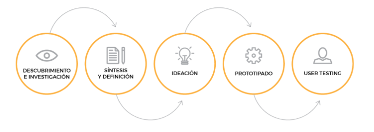
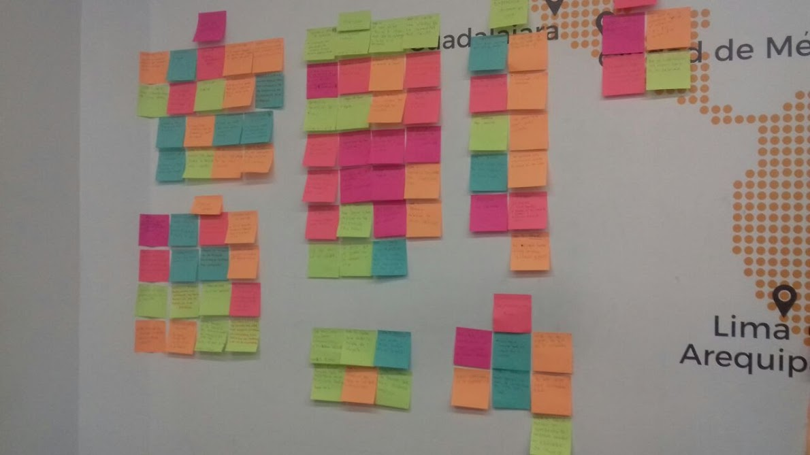

# **UX - Reto**

## **Objetivo:**

Diseñar la plataforma de venta de boletos de buses más intuitiva y amigable para el usuario.

## **Fases del Proceso:**

Para llevar a cabo el reto se siguió el proceso de UXD:
    

## **1. Descubrimiento e investigación**

### **User Research**:

Metodologías utilizadas:

* _Research Cuantitativo:_ Encuestas por internet.

* _Research Cualitativo:_ Entrevistas a usuarios en campo.

Las encuestas se realizaron el martes 30 del presente mes en dos puntos estratégicos: Terminales de buses ubicadas en 28 de Julio y Plaza Lima Norte.

_Fotos de la investigación:_  [Click](https://photos.google.com/share/AF1QipNhjbtJdhZl_5NInrbAaW0SVUJ8yRCoweozimCIk9GZrEK-VH0fg5nIPoU-KuciCA?key=UEtzQ2tfcVFSWG9UVmkwYlIxOGVEQmxGb2liMC13)

## **2. Síntesis y Definición**

Recabados y procesados los insights, se procedió a lo siguiente:

- ###  **Mapas de Afinidad (Affinity maps):**

    Mediante este, se agruparon los comentarios de los usuarios en siete aspectos claves: 
    Uso del internet, compra en agencias, servicios, temores de los usuarios, experiencia de viaje, costo de servicios y recomendaciones.

    

- ### **Selección del problema:** 

    Debido a se notó un gran contraste entre los usuarios que compran sus pasajes vía internet vs. los que compran directamente en las agencias, se optó por elegir dicha problemática (¿por qué los peruanos no compran sus pasajes por internet?).

- ### **Definición del problema:**
    Las respuestas que más usuarios nos dieron fue la siguiente: "No compro por internet porque me da miedo ser estafado". Y es precisamente ésta una de las razones por las que el peruano promedio no compra por internet. El usuario peruano siente desconfianza, inseguridad y en muchos casos desconoce cómo usar a su favor este medio.

- ### **User Persona:**
    Se elaboró el siguiente perfil de nuestro público objetivo en base a la información de nuestros usuarios. 
     

- ### **Problem Statements:**
    Los siguientes enunciados se apoyan en las necesidades de nuestro User Persona.

    - Juan necesita un modo fácil y eficiente de comprar sus boletos de viaje, ya que es un hombre muy ocupado.

    - Juan necesita un lugar cómodo y seguro para hospedarse cada vez que viaja.

    - Juan necesita transparencia y veracidad en los servicios que le ofrecen, para sentirse satisfecho.  

- ### **HMW (How Might We o Como podríamos):**
    Se formularon las siguientes preguntas con el fin de entender mejor los problemas y desarrollar mejores hipótesis. 

    -  ¿Cómo podríamos mejorar la experiencia en el proceso de compra de boletos de viaje?

    - ¿Cómo podríamos sugerir hospedajes confiables en el proceso de compra de boletos?

    - ¿Cómo mostrar la transparencia de los servicios que ofrecen las agencias de viajes?

- ### **WHAT IF?:**
    Se plantearon los siguientes enunciados que nos ayudarán a considerar nuevos actores o circunstancias en el contexto del usuario.

    - WHAT IF el usuario tiene alguna discapacidad visual.

    - WHAT IF el usuario no tuviera necesidad de buscar alojamiento. 

    - WHAT IF todas las agencias cumplieran cabalmente con los servicios que le ofrecen al usuario.

- ### **Feature List:** 

- ### **Storyboard:**

    
    

- ### **Content Prototyping:**
    En el siguiente enlace se muestra el flujo que tendrá nuestra plataforma:

    _Content Prototyping UXperts:_  [Click](https://docs.google.com/document/d/1fhyF_XFbXCHkmn9zK0FfBFnAqS5JYaAb_LDYHZaELtc/edit)